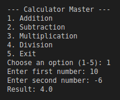
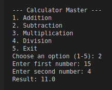
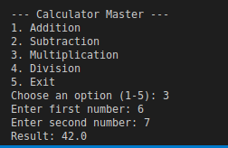
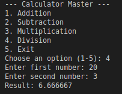

# ITNT415_Sambalilo_Samuel_CalculatorMaster

## Student
Samuel Sambalilo Jr.
BIT42

## Description
A menu driven calculator built in Python. The summative project supports addition,
subtraction, multiplication, and division, with input validation and
protection against division by zero. Each operation was developed on its
own Git branch and merged into main through a pull request.

## Branch Structure
- `main` - calculator skeleton and final integrated code
- `addition_Sambalilo` - addition feature
- `subtraction_Sambalilo` - subtraction feature
- `multiplication_Sambalilo` - multiplication feature
- `division_Sambalilo` - division feature

## Features
- Menu-driven interface with a loop that runs until the user exits
- Input validation for non-numeric entries
- Division-by-zero handling
- Rounded output for consistent results

## Sample Run

| Operation | Screenshot |
|---|---|
| Addition |  |
| Subtraction |  |
| Multiplication |  |
| Division |  |

## GitHub Evidence

| Evidence | Screenshot |
|---|---|
| All branches | [Branches.png](Screenshots/Branches.png) |
| Repo clone, config, and push (VM console) | [Console_Github.png](Screenshots/Console_Github.png) |
| Commit history - addition | [Commit_Addition.png](Screenshots/Commit_Addition.png) |
| Commit history - subtraction | [Commit_Subtraction.png](Screenshots/Commit_Subtraction.png) |
| Commit history - multiplication | [Commit_Multiplication.png](Screenshots/Commit_Multiplication.png) |
| Commit history - division | [Commit_Division.png](Screenshots/Commit_Division.png) |
| Commit history - main | [Commit_Main.png](Screenshots/Commit_Main.png) |
| All pull requests | [Pull_Requests.png](Screenshots/Pull_Requests.png) |
| Merged PR - addition | [Merge_Addition.png](Screenshots/Merge_Addition.png), [Merge_Addition2.png](Screenshots/Merge_Addition2.png) |
| Merged PR - subtraction | [Merge_Subtraction.png](Screenshots/Merge_Subtraction.png) |
| Merged PR - multiplication | [Merge_Multiplication.png](Screenshots/Merge_Multiplication.png) |
| Merged PR - division | [Merge_Division.png](Screenshots/Merge_Division.png) |

## Program Test Evidence

| Test Case | Screenshot |
|---|---|
| Addition | [Terminal_Addition.png](Screenshots/Terminal_Addition.png), [Console_Addition.png](Screenshots/Console_Addition.png), [Console_Addition2.png](Screenshots/Console_Addition2.png) |
| Subtraction | [Terminal_Subtraction.png](Screenshots/Terminal_Subtraction.png), [Console_Subtraction.png](Screenshots/Console_Subtraction.png) |
| Multiplication | [Terminal_Multiplication.png](Screenshots/Terminal_Multiplication.png), [Console_Multiplication.png](Screenshots/Console_Multiplication.png) |
| Division | [Terminal_Division.png](Screenshots/Terminal_Division.png), [Console_Division.png](Screenshots/Console_Division.png) |
| Division by zero | [Terminal_ZeroValidation.png](Screenshots/Terminal_ZeroValidation.png) |
| Invalid menu choice | [Terminal_InputValidation.png](Screenshots/Terminal_InputValidation.png) |
| Exit | [Terminal_Exit.png](Screenshots/Terminal_Exit.png) |
